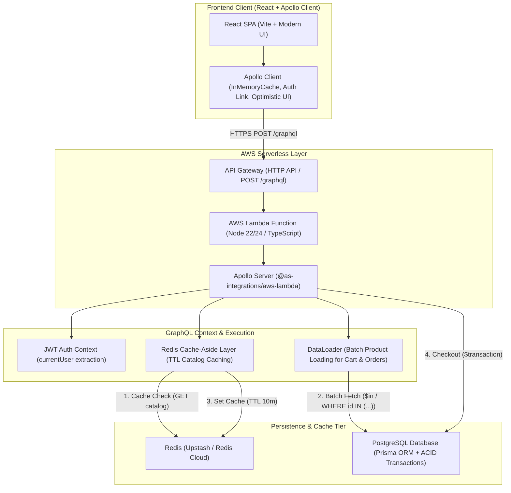

# Serverless GraphQL E-Commerce Platform

A production-ready Full-Stack E-Commerce platform built with **React (Apollo Client)**, **TypeScript**, **GraphQL (Apollo Server on AWS Lambda)**, **PostgreSQL (Prisma ORM)**, and **Redis Caching**.

---

## 🏗 Architecture Overview



---

## 📦 Project Structure (Monorepo)

```
serverless-ecommerce-graphql/
├── packages/
│   ├── backend/                     # Apollo Server on AWS Lambda + Prisma + Redis
│   │   ├── prisma/                  # PostgreSQL schema & seeds
│   │   ├── src/                     # Handlers, Resolvers, DataLoaders, Services
│   │   ├── esbuild.config.js        # High performance bundler for Lambda & Dev
│   │   ├── package.json
│   │   └── tsconfig.json
│   │
│   └── frontend/                    # React + Apollo Client + Vite
│       ├── src/                     # Apollo hooks, Components, Pages, State
│       ├── package.json
│       └── vite.config.ts
│
├── README.md
└── package.json
```

---

## 🛠 Prerequisites & Quick Start

- **Node.js**: `v20+` or `v22+` / `v24+`
- **npm**: `v9+`

### 1. Install Dependencies
```bash
npm install
```

### 2. Run Local Development
```bash
# Start backend local GraphQL server
npm run dev:backend

# Start frontend Vite server
npm run dev:frontend
```

### 3. Build & Typecheck
```bash
npm run typecheck
npm run build:backend
npm run build:frontend
```


To install axois in frontend
npm install axios --workspace=packages/frontend


To install a shared dev tool across the entire repo:

npm install -D prettier

# Start backend in watch mode (auto-restarts on code changes)
npm run dev --workspace=packages/backend

# Generate Prisma client
npm run prisma:generate --workspace=packages/backend

# Push schema changes to database
npm run prisma:push --workspace=packages/backend

# Open visual database browser in your browser
npm run prisma:studio --workspace=packages/backend

# Build with esbuild for production / AWS Lambda
npm run build --workspace=packages/backend
